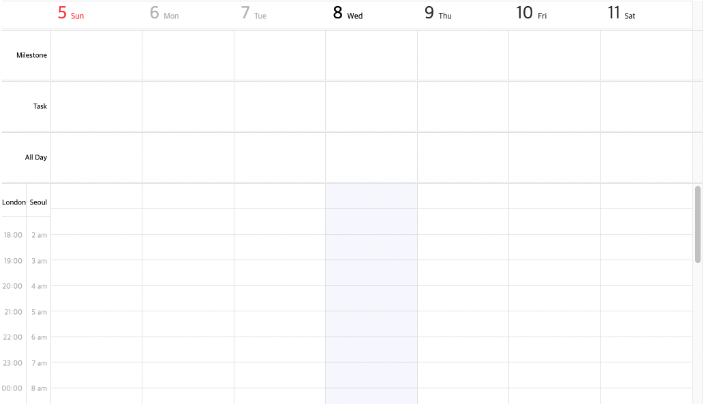
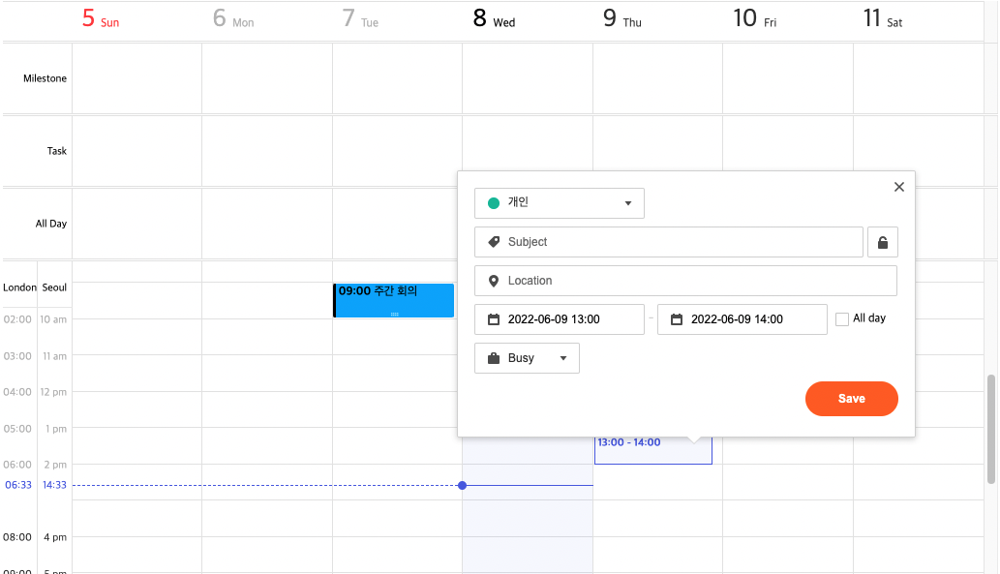
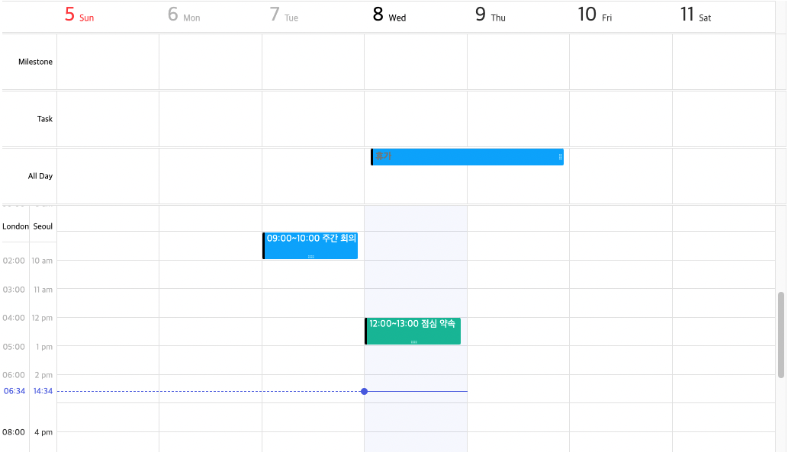

# Getting Started

## Table of Contents

- [Installation](#installation)
  - [Using the package manager](#using-the-package-manager)
    - [npm](#npm)
  - [Using Contents Delivery Network](#using-contents-delivery-network)
  - [Downloading source files](#downloading-source-files)
- [How to use the calendar](#how-to-use-the-calendar)
  - [HTML](#html)
  - [JavaScript](#javascript)
    - [Importing modules](#importing-modules)
    - [Loading bundle files for legacy browsers](#loading-bundle-files-for-legacy-browsers)
  - [CSS](#css)
  - [Creating an instance](#creating-an-instance)
- [Basic usage](#basic-usage)
  - [Disable to collect hostname for Google Analytics(GA)](#disable-to-collect-hostname-for-google-analyticsga)
  - [Creating events](#creating-events)
  - [Using pop-ups](#using-pop-ups)
  - [Applying the theme](#applying-the-theme)
  - [Applying the template](#applying-the-template)
  - [Applying instance events](#applying-instance-events)

## Installation

TOAST UI products can be used by using the package manager or by directly downloading the source code. However, it is recommended to use a package manager.

### Using the package manager

TOAST UI products are registered in the [npm](https://www.npmjs.com/) package registry. You can easily install packages using CLI tools provided by each package manager. To use npm, you need to install [Node.js](https://nodejs.org) in advance.

#### npm

```sh
npm install @toast-ui/calendar # latest version
npm install @toast-ui/calendar@<version> # specific version since 2.0
npm install tui-calendar@<version> # 1.x legacy version
```

### Using Contents Delivery Network

TOAST UI Calendar is available through CDN.

- You can get the calendar through the CDN with the code below.

```html
<link rel="stylesheet" href="https://uicdn.toast.com/calendar/latest/toastui-calendar.min.css" />
<script src="https://uicdn.toast.com/calendar /latest/toastui-calendar.min.js"></script>

<!-- To get bundle file for legacy browser -->
<!-- <script src="https://uicdn.toast.com/calendar /latest/toastui-calendar.ie11.min.js"></script> -->

<!-- Import as es module -->
<!-- <script type="module" src="https:// uicdn.toast.com/calendar/latest/toastui-calendar.mjs"></script> -->
```

- CDN consists of the following directory structure.

```
- uicdn.toast.com/
  ├─ calendar/
  │  ├─ latest
  │  │  ├─ toastui-calendar.css
  │  │  ├─ toastui-calendar.js
  │  │  ├─ toastui-calendar.min.css
  │  │  ├─ toastui-calendar.min.js
  │  │  ├─ toastui-calendar.ie11.js
  │  │  ├─ toastui-calendar.ie11.min.js
  │  │  │  toastui-calendar.mjs
  │  ├─ v2.0.0/
```

### Downloading source files

- [Download the source code for each version](https://github.com/nhn/tui.calendar/releases)

## How to use the calendar

### HTML

Add a container element where TOAST UI Calendar will be created. **This element must have a height value of the appropriate height. (at least 600px recommended)**

```html
<div id="calendar" style="height: 600px;"></div>
```

### JavaScript

#### Importing modules

TOAST UI Calendar can be instantiated through the constructor function. There are three ways to access the constructor function depending on the environment.

```js
/* ES6 module in Node.js environment */
import Calendar from '@toast-ui/calendar';
```

```js
/* CommonJS in Node.js environment */
const Calendar = require('@toast-ui/calendar');
```

```js
/* in the browser environment namespace */
const Calendar = tui.Calendar;
```

#### Loading bundle files for legacy browsers

TOAST UI Calendar provides a separate bundle file for legacy browsers. The default bundle provides stable support for the latest two versions of the modern browser. However, the default bundle does not include a polyfill for IE11, so to support IE11 or a legacy browser below a certain level, you need to add the IE11 bundle that includes a polyfill as follows.

Since the bundle size of IE11 is about 30% larger than that of the default bundle, you must take care not to increase the bundle size unnecessarily by considering the range of support.

```js
/* ES6 module in Node.js environment */
import Calendar from '@toast-ui/calendar/ie11';
```

```js
/* CommonJS in Node.js environment */
const Calendar = require('@toast-ui/calendar/ie11');
```

```html
<!-- with CDN and browser environment namespace -->
<script src="https://uicdn.toast.com/calendar/latest/toastui-calendar.ie11.min.js"></script>
<script>
  const Calendar = tui.Calendar;
</script>
```

### CSS

To use the calendar, you need to add a CSS file. You can import the CSS file through import or require, or you can import them through CDN.

```js
/* ES6 module in Node.js environment */
import '@toast-ui/calendar/dist/toastui-calendar.min.css'; // Stylesheet for calendar
```

```js
/* CommonJS in Node.js environment */
require('@toast-ui/calendar/dist/toastui-calendar.min.css');
```

```html
<!-- CDN -->
<link rel="stylesheet" href="https://uicdn.toast.com/calendar/latest/toastui-calendar.min.css" />
```

### Creating an instance

The constructor takes two arguments: `container` and `options`.

- `container` : HTML element that has TOAST UI Calendar as a child element or CSS selector string to get the HTML element
- `options` : Options object that can customize TOAST UI Calendar, such as default view type, time zone, theme, and template. For more information, see the [Options documentation](../apis/options.md).

```js
const container = document.getElementById('calendar');
const options = {
  defaultView: 'week',
  timezone: {
    zones: [
      {
        timezoneName: 'Asia/Seoul',
        displayLabel: 'Seoul',
      },
      {
        timezoneName: 'Europe/London',
        displayLabel: 'London',
      },
    ],
  },
  calendars: [
    {
      id: 'cal1',
      name: 'Personal',
      backgroundColor: '#03bd9e',
    },
    {
      id: 'cal2',
      name: 'Work',
      backgroundColor: '#00a9ff',
    },
  ],
};

const calendar = new Calendar(container, options);
```



## Basic usage

### Disable to collect hostname for Google Analytics(GA)

[TOAST UI Calendar](https://github.com/nhn/tui.calendar) applies [GA](https://analytics.google.com/analytics/web/) to collect statistics on open source usage to see how widespread it is around the world. This serves as an important indicator to determine the future progress of the project. It collects `location.hostname` (e.g. "ui.toast.com") and is only used to measure usage statistics.

To disable GA, set the [`usageStatistics` option](/docs/en/apis/options.md#usagestatistics) to `false`:

```js
const calendar = new Calendar('#calendar', {
  usageStatistics: false
});
```

### Creating events

When creating an event, use the [`createEvents` method](../apis/calendar.md#createevents) of the Calendar instance.

Event information should be in the form of [EventObject](../apis/event-object.md).

```js
calendar.createEvents([
  {
    id: 'event1',
    calendarId: 'cal2',
    title: 'Weekly meeting',
    start: '2022-06-07T09:00:00',
    end: '2022-06-07T10:00:00',
  },
  {
    id: 'event2',
    calendarId: 'cal1',
    title: 'Lunch appointment',
    start: '2022-06-08T12:00:00',
    end: '2022-06-08T13:00:00',
  },
  {
    id: 'event3',
    calendarId: 'cal2',
    title: 'Vacation',
    start: '2022-06-08',
    end: '2022-06-10',
    isAllday: true,
    category: 'allday',
  },
]);
```


### Using pop-ups

TOAST UI Calendar provides an event form popup and an event details popup by default. To use the popups, the [`useFormPopup`](../apis/options.md#useformpopup) and [`useDetailPopup`](../apis/options.md#usedetailpopup) options must be set to `true`. Options can be set when creating an instance or changed using the [`setOptions`](../apis/calendar.md#setoptions) method after instance creation.

When using the event form popup, you must import CSS files of [`tui-date-picker`](https://github.com/nhn/tui.date-picker) and [`tui-time-picker`](https://github.com/nhn/tui.time-picker) for the style to be applied properly.

```sh
npm install tui-date-picker tui-time-picker
```

```js
// Load the css files of tui-date-picker and tui-time-picker to use the event creation popup.
import 'tui-date-picker/dist/tui-date-picker.css';
import 'tui-time-picker/dist/tui-time-picker.css';

calendar.setOptions({
  useFormPopup: true,
  useDetailPopup: true,
});
```

| Event creation popup                                    | Event details pop-up                                        |
| ------------------------------------------------ | ----------------------------------------------------- |
|  |  |

### Applying the theme

Use themes when you want to change styles such as color and background color. The theme can be specified in [the `theme` property of the options object](../apis/options.md#theme) when an instance is created, or can be changed using the [`setTheme`](../apis/calendar.md#settheme) method after instance creation. For available themes, refer to the [theme documentation](../apis/theme.md).

```js
calendar.setTheme({
  common: {
    gridSelection: {
      backgroundColor: 'rgba(81, 230, 92, 0.05)',
      border: '1px dotted #515ce6',
    },
  },
});
```


### Applying the template

Templates are features that support custom rendering. It can be specified in [the `template` property of the options object](../apis/options.md#template) when creating an instance, or can be changed using the [`setOptions`](../apis/calendar.md#setoptions) method after instance creation. For available templates, refer to the [Templates document](../apis/template.md).

```js
function formatTime(time) {
  const hours = `${time.getHours()}`.padStart(2, '0');
  const minutes = `${time.getMinutes()}`.padStart(2, '0');

  return `${hours}:${minutes}`;
}

calendar.setOptions({
  template: {
    time(event) {
      const { start, end, title } = event;

      return `<span style="color: white;">${formatTime(start)}~${formatTime(end)} ${title}</span>`;
    },
    allday(event) {
      return `<span style="color: gray;">${event.title}</span>`;
    },
  },
});
```



### Applying instance events

TOAST UI Calendar provides instance events. If necessary, you can set to receive events and execute desired actions. In addition, the user can set up their own event separately.

You can listen for instance events using the `on` method.

For details, refer to the [instance event documentation](../apis/calendar.md#instance-events).

```js
calendar.on('clickEvent', ({ event }) => {
  const el = document.getElementById('clicked-event');
  el.innerText = event.title;
});
```


