# 테마

## 설명

색상, 배경색 등을 변경하여 원하는 테마를 적용할 수 있다. `setTheme` 메서드를 통해 자유롭게 테마를 변경할 수 있다.

```js
// 인스턴스를 생성하며 테마 설정하기
const calendar = new Calendar('#container', {
  theme: {
    week: {
      today: {
        color: 'blue',
      },
    },
  },
});

// 생성된 인스턴스의 테마를 setTheme 메서드로 변경하기
calendar.setTheme({
  week: {
    today: {
      color: 'red',
    },
  },
});
```

## 테마 객체

테마 객체는 공통으로 적용되는 `common`, 주간/일간뷰를 위한 `week`, 월간뷰를 위한 `month` 세 부분으로 나뉘어진 중첩 객체다. 모든 값은 해당 속성에 대응되는 CSS 문자열 값이다.

```ts
interface ThemeObject {
  common: CommonTheme;
  week: WeekTheme;
  month: MonthTheme;
}
```

### common 테마

```ts
interface CommonTheme {
  backgroundColor: string;
  border: string;
  gridSelection: {
    backgroundColor: string;
    border: string;
  };
  dayName: { color: string };
  holiday: { color: string };
  saturday: { color: string };
  today: { color: string };
}
```

| 테마                                       | 기본값                              | 설명            |
| ------------------------------------------ | ----------------------------------- | --------------- |
| [backgroundColor](#common-backgroundcolor) | <code>'white'</code>                | 캘린더의 배경색 |
| [border](#common-border)                   | <code>'1px solid #e5e5e5'</code>    | 캘린더의 테두리 |
| [gridSelection](#common-gridselection)     | <code>DEFAULT_GRID_SELECTION</code> | 날짜/시간 선택  |
| [dayName](#common-dayname)                 | <code>{ color: '#333' }</code>      | 요일            |
| [holiday](#common-holiday)                 | <code>{ color: '#ff4040' }</code>   | 휴일            |
| [saturday](#common-saturday)               | <code>{ color: '#333' }</code>      | 토요일          |
| [today](#common-today)                     | <code>{ color: '#fff' }</code>      | 오늘            |

```ts
const DEFAULT_GRID_SELECTION = {
  backgroundColor: 'rgba(81, 92, 230, 0.05)',
  border: '1px solid #515ce6',
};
```

### week 테마

```ts
interface WeekTheme {
  dayName: {
    borderLeft: string;
    borderTop: string;
    borderBottom: string;
    backgroundColor: string;
  };
  dayGrid: {
    borderRight: string;
    backgroundColor: string;
  };
  dayGridLeft: {
    borderRight: string;
    backgroundColor: string;
    width: string;
  };
  timeGrid: { borderRight: string };
  timeGridLeft: {
    borderRight: string;
    backgroundColor: string;
    width: string;
  };
  timeGridLeftAdditionalTimezone: { backgroundColor: string };
  timeGridHalfHour: { borderBottom: string };
  nowIndicatorLabel: { color: string };
  nowIndicatorPast: { border: string };
  nowIndicatorBullet: { backgroundColor: string };
  nowIndicatorToday: { border: string };
  nowIndicatorFuture: { border: string };
  pastTime: { color: string };
  futureTime: { color: string };
  weekend: { backgroundColor: string };
  today: { color: string; backgroundColor: string };
  pastDay: { color: string };
  panelResizer: { border: string };
  gridSelection: { color: string };
}
```

| 테마                                                                   | 기본값                                             | 설명                                                                                   |
| ---------------------------------------------------------------------- | -------------------------------------------------- | -------------------------------------------------------------------------------------- |
| [dayName](#week-dayname)                                               | <code>DEFAULT_WEEK_DAYNAME</code>                  | 요일                                                                                   |
| [dayGrid](#week-daygrid)                                               | <code>DEFAULT_DAY_GRID</code>                      | 주간/일간뷰에서 패널의 각 셀                                                           |
| [dayGridLeft](#week-daygridleft)                                       | <code>DEFAULT_DAY_GRID_LEFT</code>                 | 주간/일간뷰에서 패널 왼쪽 영역                                                         |
| [timeGrid](#week-timegrid)                                             | <code>{ borderRight: '1px solid #e5e5e5' }</code>  | 주간/일간뷰에서 timed 이벤트 영역                                                      |
| [timeGridLeft](#week-timegridleft)                                     | <code>DEFAULT_TIME_GRID_LEFT</code>                | 주간/일간뷰에서 timed 이벤트 영역의 왼쪽 영역                                          |
| [timeGridLeftAdditionalTimezone](#week-timegridleftadditionaltimezone) | <code>{ backgroundColor: 'white' }</code>          | 주간/일간뷰에서 timed 이벤트 영역의 왼쪽 영역에 표시되는 서브 타임존                   |
| [timeGridHalfHourLine](#week-timegridhalfhourline)                     | <code>{ borderBottom: '1px solid #e5e5e5' }</code> | 주간/일간뷰에서 timed 이벤트 영역에서 매 시간의 30분 선                                |
| [timeGridHourLine](#week-timegridhourline)                             | <code>{ borderBottom: '1px solid #e5e5e5' }</code> | 주간/일간뷰에서 timed 이벤트 영역에서 매 시간의 정각 선                                |
| [nowIndicatorLabel](#week-nowindicatorlabel)                           | <code>{ color: '#515ce6' }</code>                  | 현재 시간선에 표시되는 현재 시각 텍스트                                                |
| [nowIndicatorPast](#week-nowindicatorpast)                             | <code>{ border: '1px dashed #515ce6' }</code>      | 현재 시간선에서 지난 날짜선                                                            |
| [nowIndicatorBullet](#week-nowindicatorbullet)                         | <code>{ backgroundColor: '#515ce6' }</code>        | 현재 시간선에서 오늘 날짜                                                              |
| [nowIndicatorToday](#week-nowindicatortoday)                           | <code>{ border: '1px solid #515ce6' }</code>       | 현재 시간선에서 오늘 날짜선                                                            |
| [nowIndicatorFuture](#week-nowindicatorfuture)                         | <code>{ border: 'none' }</code>                    | 현재 시간선에서 미래 날짜선                                                            |
| [pastTime](#week-pasttime)                                             | <code>{ color: '#bbb' }</code>                     | 주간/일간뷰에서 timed 이벤트 영역의 왼쪽 영역에 표시되는 지난 시간                     |
| [futureTime](#week-futuretime)                                         | <code>{ color: '#333' }</code>                     | 주간/일간뷰에서 timed 이벤트 영역의 왼쪽 영역에 표시되는 미래 시간                     |
| [weekend](#week-weekend)                                               | <code>{ backgroundColor: 'inherit' }</code>        | 주간/일간뷰에서 timed 이벤트 영역의 주말 컬럼                                          |
| [today](#week-today)                                                   | <code>DEFAULT_TODAY</code>                         | 주간/일간뷰에서 timed 이벤트 영역의 오늘 컬럼(color는 dayName, backgroundColor는 컬럼) |
| [pastDay](#week-pastday)                                               | <code>{ color: '#bbb' }</code>                     | 주간/일간뷰에서 과거 요일                                                              |
| [panelResizer](#week-panelresizer)                                     | <code>{ border: '1px solid #e5e5e5' }</code>       | 패널 크기 조절 컴포넌트                                                                |
| [gridSelection](#week-gridselection)                                   | <code>{ color: '#515ce6' }</code>                  | 주간/일간뷰에서 날짜/시간 선택                                                         |

```ts
const DEFAULT_WEEK_DAYNAME = {
  borderLeft: 'none',
  borderTop: '1px solid #e5e5e5',
  borderBottom: '1px solid #e5e5e5',
  backgroundColor: 'inherit',
};

const DEFAULT_DAY_GRID = {
  borderRight: '1px solid #e5e5e5',
  backgroundColor: 'inherit',
};

const DEFAULT_DAY_GRID_LEFT = {
  borderRight: '1px solid #e5e5e5',
  backgroundColor: 'inherit',
  width: '72px',
};

const DEFAULT_TIME_GRID_LEFT = {
  backgroundColor: 'inherit',
  borderRight: '1px solid #e5e5e5',
  width: '72px',
};

const DEFAULT_TODAY = {
  color: 'inherit',
  backgroundColor: 'rgba(81, 92, 230, 0.05)',
};
```

### month 테마

```ts
interface MonthTheme {
  dayExceptThisMonth: { color: string };
  dayName: {
    borderLeft: string;
    backgroundColor: string;
  };
  holidayExceptThisMonth: { color: string };
  moreView: {
    backgroundColor: string;
    border: string;
    boxShadow: string;
    width: number | null,
    height: number | null,
  };
  moreViewTitle: {
    backgroundColor: string;
  };
  weekend: { backgroundColor: string };
  gridCell: {
    headerHeight: number | null;
    footerHeight: number | null;
  };
}
```

| 테마                                                    | 기본값                                                | 설명                                |
| ------------------------------------------------------- | ----------------------------------------------------- | ----------------------------------- |
| [dayExceptThisMonth](#month-dayexceptthismonth)         | <code>{ color: 'rgba(51, 51, 51, 0.4)' }</code>       | 다른 달인 날짜                      |
| [holidayExceptThisMonth](#month-holidayexceptthismonth) | <code>{ color: 'rgba(255, 64, 64, 0.4)' }</code>      | 다른 달인 휴일                      |
| [dayName](#month-dayname)                               | <code>DEFAULT_MONTH_DAYNAME</code>                    | 요일                                |
| [moreView](#month-moreview)                             | <code>DEFAULT_MORE_VIEW</code>                        | 월간뷰의 더보기 팝업                |
| [moreViewTitle](#month-moreviewtitle)                   | <code>{ backgroundColor: 'inherit' }</code>           | 월간뷰의 더보기 팝업의 헤더 영역    |
| [weekend](#month-weekend)                               | <code>{ backgroundColor: 'inherit' }</code>           | 월간뷰의 주말 셀                    |
| [gridCell](#month-gridcell)                             | <code>{ headerHeight: 31, footerHeight: null }</code> | 월간뷰의 모든 셀의 헤더와 푸터 높이 |

```ts
const DEFAULT_MONTH_DAYNAME = {
  borderLeft: 'none',
  backgroundColor: 'inherit',
};

const DEFAULT_MORE_VIEW = {
  border: '1px solid #d5d5d5',
  boxShadow: '0 2px 6px 0 rgba(0, 0, 0, 0.1)',
  backgroundColor: 'white',
  width: null,
  height: null,
};
```

## 사용 예시

### common

#### common-backgroundColor

배경색을 지정한다. 기본 값은 `'white'`다.

```js
calendar.setTheme({
  common: {
    backgroundColor: 'black',
  },
});
```

[⬆ 목록으로 돌아가기](#common-테마)

#### common-border

테두리를 지정한다. 기본 값은 `'1px solid #e5e5e5'`다.

```js
calendar.setTheme({
  common: {
    border: '1px dotted #e5e5e5',
  },
});
```

[⬆ 목록으로 돌아가기](#common-테마)

#### common-gridSelection

날짜/시간 선택의 배경색, 테두리를 지정한다. 기본 값은 `backgroundColor`의 경우 `'rgba(81, 92, 230, 0.05)'`, `border`의 경우 `'1px solid #515ce6'`이다.

| 기본값 적용                                                                   | 예제 적용                                                                    |
| ----------------------------------------------------------------------------- | ---------------------------------------------------------------------------- |
|  | 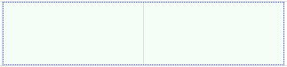 |

```js
calendar.setTheme({
  common: {
    gridSelection: {
      backgroundColor: 'rgba(81, 230, 92, 0.05)',
      border: '1px dotted #515ce6',
    },
  },
});
```

[⬆ 목록으로 돌아가기](#common-테마)

#### common-dayName

요일 색상을 지정한다. 기본 값은 `'#333'`이다.

| 기본값 적용                                                       | 예제 적용                                                        |
| ----------------------------------------------------------------- | ---------------------------------------------------------------- |
|  |  |

```js
calendar.setTheme({
  common: {
    dayName: {
      color: '#515ce6',
    },
  },
});
```

[⬆ 목록으로 돌아가기](#common-테마)

#### common-holiday

휴일 색상을 지정한다. 기본 값은 `'#ff4040'`이다.

| 기본값 적용                                                       | 예제 적용                                                        |
| ----------------------------------------------------------------- | ---------------------------------------------------------------- |
|  | 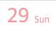 |

```js
calendar.setTheme({
  common: {
    holiday: {
      color: 'rgba(255, 64, 64, 0.5)',
    },
  },
});
```

[⬆ 목록으로 돌아가기](#common-테마)

#### common-saturday

토요일 색상을 지정한다. 기본 값은 `'#333'`이다.

| 기본값 적용                                                         | 예제 적용                                                          |
| ------------------------------------------------------------------- | ------------------------------------------------------------------ |
|  |  |

```js
calendar.setTheme({
  common: {
    saturday: {
      color: 'rgba(64, 64, 255, 0.5)',
    },
  },
});
```

[⬆ 목록으로 돌아가기](#common-테마)

#### common-today

오늘 색상을 지정한다. 기본 값은 `'#fff'`이다.

| 기본값 적용                                                   | 예제 적용                                                    |
| ------------------------------------------------------------- | ------------------------------------------------------------ |
|  |  |

```js
calendar.setTheme({
  common: {
    today: {
      color: 'grey',
    },
  },
});
```

[⬆ 목록으로 돌아가기](#common-테마)

### week

#### week-dayName

주간/일간뷰의 요일을 지정한다. `borderLeft`, `borderTop`, `borderBottom`, `backgroundColor`로 왼쪽, 위, 아래 테두리와 배경색을 지정할 수 있으며 각 기본 값은 `'none'`, `'1px solid #e5e5e5'`, `'1px solid #e5e5e5'`, `'inherit'`이다.

| 기본값 적용                                                   | 예제 적용                                                    |
| ------------------------------------------------------------- | ------------------------------------------------------------ |
|  |  |

```js
calendar.setTheme({
  week: {
    dayName: {
      borderLeft: 'none',
      borderTop: '1px dotted red',
      borderBottom: '1px dotted red',
      backgroundColor: 'rgba(81, 92, 230, 0.05)',
    },
  },
});
```

[⬆ 목록으로 돌아가기](#week-테마)

#### week-dayGrid

주간/일간뷰의 각 패널의 셀을 지정한다. `borderRight`, `backgroundColor`로 오른쪽 테두리와 배경색을 지정할 수 있으며 각 기본 값은 `'1px solid #e5e5e5'`, `'inherit'`이다. 배경색 변경 시에 주말을 제외한 컬럼의 배경색도 변경된다.

| 기본값 적용                                                   | 예제 적용                                                    |
| ------------------------------------------------------------- | ------------------------------------------------------------ |
| 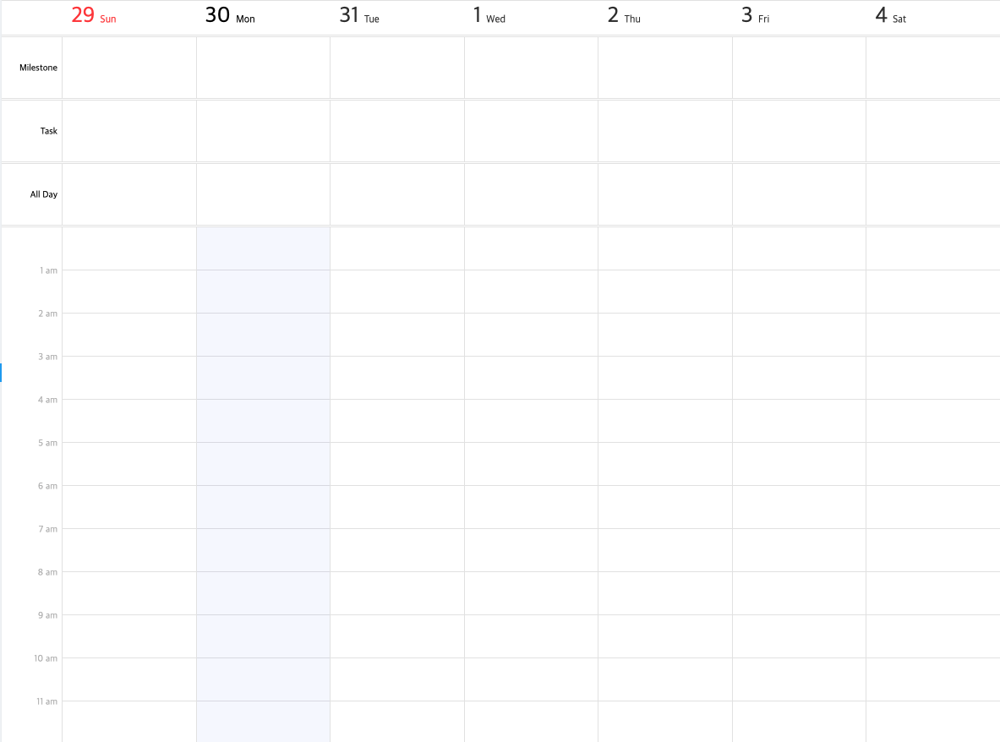 |  |

```js
calendar.setTheme({
  week: {
    dayGrid: {
      borderRight: 'none',
      backgroundColor: 'rgba(81, 92, 230, 0.05)',
    },
  },
});
```

[⬆ 목록으로 돌아가기](#week-테마)

#### week-dayGridLeft

주간/일간뷰에서 각 패널의 왼쪽 영역을 지정한다. `borderRight`, `backgroundColor`, `width`로 오른쪽 테두리, 배경색, 너비를 지정할 수 있으며 각 기본 값은 `'1px solid #e5e5e5'`, `'inherit'`, `'72px'`이다.

| 기본값 적용                                                           | 예제 적용                                                            |
| --------------------------------------------------------------------- | -------------------------------------------------------------------- |
|  |  |

```js
calendar.setTheme({
  week: {
    dayGridLeft: {
      borderRight: 'none',
      backgroundColor: 'rgba(81, 92, 230, 0.05)',
      width: '144px',
    },
  },
});
```

[⬆ 목록으로 돌아가기](#week-테마)

#### week-timeGrid

주간/일간뷰에서 timed 이벤트 영역을 지정한다. `borderRight`로 오른쪽 테두리를 지정할 수 있으며 기본 값은 `'1px solid #e5e5e5'`다.

| 기본값 적용                                                     | 예제 적용                                                      |
| --------------------------------------------------------------- | -------------------------------------------------------------- |
| 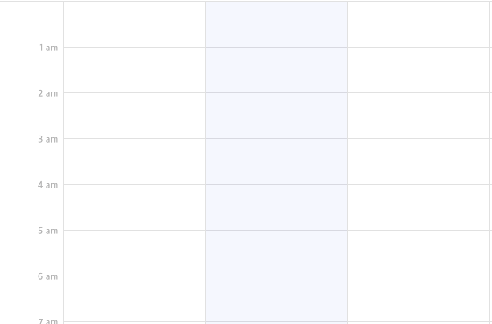 | 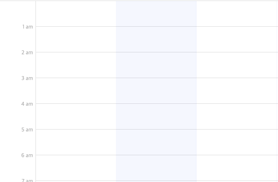 |

```js
calendar.setTheme({
  week: {
    timeGrid: {
      borderRight: '1px solid #e5e5e5',
    },
  },
});
```

[⬆ 목록으로 돌아가기](#week-테마)

#### week-timeGridLeft

주간/일간뷰에서 timed 이벤트 영역의 왼쪽 영역을 지정한다. `borderRight`, `backgroundColor`, `width`로 오른쪽 테두리와 배경색, 너비를 지정할 수 있으며 각 기본 값은 `'1px solid #e5e5e5'`, `'inherit'`, `'72px'`이다.

| 기본값 적용                                                             | 예제 적용                                                              |
| ----------------------------------------------------------------------- | ---------------------------------------------------------------------- |
| 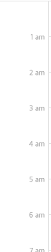 | 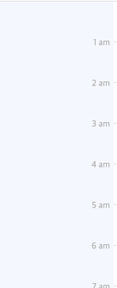 |

```js
calendar.setTheme({
  week: {
    timeGridLeft: {
      borderRight: 'none',
      backgroundColor: 'rgba(81, 92, 230, 0.05)',
      width: '144px',
    },
  },
});
```

[⬆ 목록으로 돌아가기](#week-테마)

#### week-timeGridLeftAdditionalTimezone

주간/일간뷰에서 timed 이벤트 영역의 왼쪽 영역에 표시되는 서브 타임존을 지정한다. `backgroundColor`로 배경색을 지정할 수 있으며 기본 값은 `'white'`이다.

| 기본값 적용                                                                                                 | 예제 적용                                                                                                  |
| ----------------------------------------------------------------------------------------------------------- | ---------------------------------------------------------------------------------------------------------- |
| 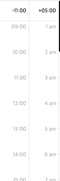 |  |

```js
calendar.setTheme({
  week: {
    timeGridLeftAdditionalTimezone: {
      backgroundColor: '#e5e5e5',
    },
  },
});
```

[⬆ 목록으로 돌아가기](#week-테마)

#### week-timeGridHalfHourLine

주간/일간뷰에서 timed 이벤트 영역에서 매 시간의 30분 선을 지정한다. `borderBottom`으로 아래 테두리를 지정할 수 있으며 기본 값은 `'none'`이다.

| 기본값 적용                                                                             | 예제 적용                                                                              |
| --------------------------------------------------------------------------------------- | -------------------------------------------------------------------------------------- |
|  |  |

```js
calendar.setTheme({
  week: {
    timeGridHalfHourLine: {
      borderBottom: '1px dotted #e5e5e5',
    },
  },
});
```

#### week-timeGridHourLine

주간/일간뷰에서 timed 이벤트 영역에서 매 시간의 정각 선을 지정한다. `borderBottom`으로 아래 테두리를 지정할 수 있으며 기본 값은 `'none'`이다.

| 기본값 적용                                                                     | 예제 적용                                                                      |
| ------------------------------------------------------------------------------- | ------------------------------------------------------------------------------ |
|  | 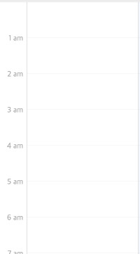 |

```js
calendar.setTheme({
  week: {
    timeGridHourLine: {
      borderBottom: '1px solid #f9f9f9',
    },
  },
});
```

[⬆ 목록으로 돌아가기](#week-테마)

#### week-nowIndicatorLabel

현재 시간선에 표시되는 현재 시각 텍스트를 지정한다. `color`로 글자색을 지정할 수 있으며 기본 값은 `'#515ce6'`이다.

| 기본값 적용                                                                       | 예제 적용                                                                        |
| --------------------------------------------------------------------------------- | -------------------------------------------------------------------------------- |
|  |  |

```js
calendar.setTheme({
  week: {
    nowIndicatorLabel: {
      color: 'red',
    },
  },
});
```

[⬆ 목록으로 돌아가기](#week-테마)

#### week-nowIndicatorPast

현재 시간선에서 지난 날짜선을 지정한다. `border`로 선의 테두리를 지정할 수 있으며 기본 값은 `'1px dashed #515ce6'`이다.

| 기본값 적용                                                                     | 예제 적용                                                                      |
| ------------------------------------------------------------------------------- | ------------------------------------------------------------------------------ |
|  |  |

```js
calendar.setTheme({
  week: {
    nowIndicatorPast: {
      border: '1px dashed red',
    },
  },
});
```

[⬆ 목록으로 돌아가기](#week-테마)

#### week-nowIndicatorBullet

현재 시간선에서 오늘 날짜에 표시되는 점을 지정한다. `backgroundColor`로 배경색을 지정할 수 있으며 기본 값은 `'#515ce6'`이다.

| 기본값 적용                                                                         | 예제 적용                                                                          |
| ----------------------------------------------------------------------------------- | ---------------------------------------------------------------------------------- |
|  |  |

```js
calendar.setTheme({
  week: {
    nowIndicatorBullet: {
      backgroundColor: '#515ce6',
    },
  },
});
```

[⬆ 목록으로 돌아가기](#week-테마)

#### week-nowIndicatorToday

현재 시간선에서 오늘 날짜선을 지정한다. `border`로 선의 테두리를 지정할 수 있으며 기본 값은 `'1px solid #515ce6'`이다.

| 기본값 적용                                                                       | 예제 적용                                                                        |
| --------------------------------------------------------------------------------- | -------------------------------------------------------------------------------- |
|  |  |

```js
calendar.setTheme({
  week: {
    nowIndicatorToday: {
      border: '1px solid red',
    },
  },
});
```

[⬆ 목록으로 돌아가기](#week-테마)

#### week-nowIndicatorFuture

현재 시간선에서 미래 날짜선을 지정한다. `border`로 선의 테두리를 지정할 수 있으며 기본 값은 `'none'`이다.

| 기본값 적용                                                                         | 예제 적용                                                                          |
| ----------------------------------------------------------------------------------- | ---------------------------------------------------------------------------------- |
| 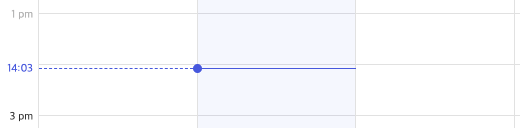 |  |

```js
calendar.setTheme({
  week: {
    nowIndicatorFuture: {
      border: '1px solid red',
    },
  },
});
```

[⬆ 목록으로 돌아가기](#week-테마)

#### week-pastTime

주간/일간뷰에서 timed 이벤트 영역의 왼쪽 영역에 표시되는 지난 시간을 지정한다. `color`로 글자색을 지정할 수 있으며 기본 값은 `'#bbb'`다.

| 기본값 적용                                                     | 예제 적용                                                      |
| --------------------------------------------------------------- | -------------------------------------------------------------- |
| 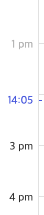 |  |

```js
calendar.setTheme({
  week: {
    pastTime: {
      color: 'red',
    },
  },
});
```

[⬆ 목록으로 돌아가기](#week-테마)

#### week-futureTime

주간/일간뷰에서 timed 이벤트 영역의 왼쪽 영역에 표시되는 미래 시간을 지정한다. `color`로 글자색을 지정할 수 있으며 기본 값은 `'#333'`다.

| 기본값 적용                                                         | 예제 적용                                                          |
| ------------------------------------------------------------------- | ------------------------------------------------------------------ |
| 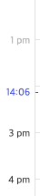 |  |

```js
calendar.setTheme({
  week: {
    futureTime: {
      color: 'red',
    },
  },
});
```

[⬆ 목록으로 돌아가기](#week-테마)

#### week-weekend

주간/일간뷰에서 timed 이벤트 영역의 주말 컬럼을 지정한다. `backgroundColor`로 배경색을 지정할 수 있으며 기본 값은 `'inherit'`이다.

| 기본값 적용                                                   | 예제 적용                                                    |
| ------------------------------------------------------------- | ------------------------------------------------------------ |
| 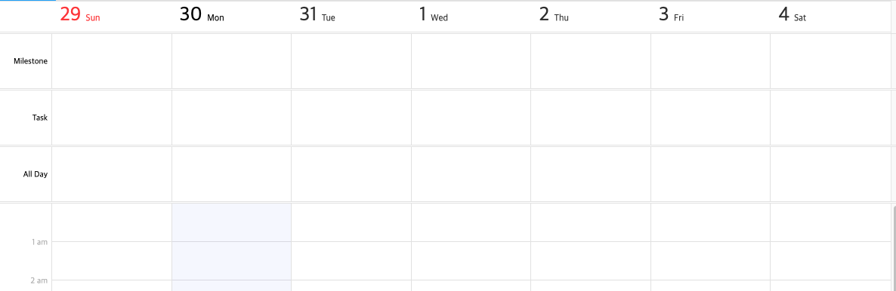 |  |

```js
calendar.setTheme({
  week: {
    weekend: {
      backgroundColor: 'rgba(255, 64, 64, 0.05)',
    },
  },
});
```

[⬆ 목록으로 돌아가기](#week-테마)

#### week-today

주간/일간뷰에서 timed 이벤트 영역의 오늘 컬럼을 지정한다. `color`로 글자색, `backgroundColor`로 배경색을 지정할 수 있으며 각 기본 값은 `'inherit'`, `'rgba(81, 92, 230, 0.05)'`이다.
color는 요일에 적용되고 backgroundColor는 컬럼에 적용된다.

| 기본값 적용                                               | 예제 적용                                                |
| --------------------------------------------------------- | -------------------------------------------------------- |
| 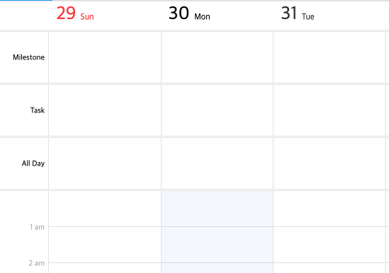 | 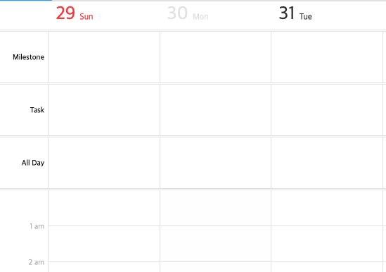 |

```js
calendar.setTheme({
  week: {
    today: {
      color: '#e5e5e5',
      backgroundColor: 'rgba(229, 229, 229, 0.05)',
    },
  },
});
```

[⬆ 목록으로 돌아가기](#week-테마)

#### week-pastDay

주간/일간뷰에서 과거 요일을 지정한다. `color`로 글자색을 지정할 수 있으며 기본 값은 `'#bbb'`다.

| 기본값 적용                                                   | 예제 적용                                                    |
| ------------------------------------------------------------- | ------------------------------------------------------------ |
|  | 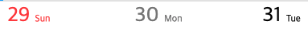 |

```js
calendar.setTheme({
  week: {
    pastDay: {
      color: 'grey',
    },
  },
});
```

[⬆ 목록으로 돌아가기](#week-테마)

#### week-panelResizer

패널 크기 조절 컴포넌트을 지정한다. `border`로 테두리를 지정할 수 있으며 기본 값은 `'1px solid #e5e5e5'`이다.

| 기본값 적용                                                             | 예제 적용                                                              |
| ----------------------------------------------------------------------- | ---------------------------------------------------------------------- |
|  |  |

```js
calendar.setTheme({
  week: {
    panelResizer: {
      border: '1px dotted #e5e5e5',
    },
  },
});
```

[⬆ 목록으로 돌아가기](#week-테마)

#### week-gridSelection

주간/일간뷰에서 날짜/시간 선택을 지정한다. `color`로 글자색을 지정할 수 있으며 기본 값은 `'#515ce6'`이다.

| 기본값 적용                                                               | 예제 적용                                                                |
| ------------------------------------------------------------------------- | ------------------------------------------------------------------------ |
|  |  |

```js
calendar.setTheme({
  week: {
    gridSelection: {
      color: 'grey',
    },
  },
});
```

[⬆ 목록으로 돌아가기](#week-테마)

### month

#### month-dayExceptThisMonth

다른 달인 날짜를 지정한다. `color`로 글자색을 지정할 수 있으며 기본 값은 `'rgba(51, 51, 51, 0.4)'`이다.

| 기본값 적용                                                                           | 예제 적용                                                                            |
| ------------------------------------------------------------------------------------- | ------------------------------------------------------------------------------------ |
|  | 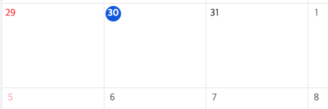 |

```js
calendar.setTheme({
  month: {
    dayExceptThisMonth: {
      color: 'grey',
    },
  },
});
```

[⬆ 목록으로 돌아가기](#month-테마)

#### month-holidayExceptThisMonth

다른 달인 휴일을 지정한다. `color`로 글자색을 지정할 수 있으며 기본 값은 `'rgba(255, 64, 64, 0.4)'`이다.

| 기본값 적용                                                                                   | 예제 적용                                                                                    |
| --------------------------------------------------------------------------------------------- | -------------------------------------------------------------------------------------------- |
|  |  |

```js
calendar.setTheme({
  month: {
    holidayExceptThisMonth: {
      color: 'blue',
    },
  },
});
```

[⬆ 목록으로 돌아가기](#month-테마)

#### month-dayName

요일을 지정한다. `borderLeft`, `backgroundColor`로 왼쪽 테두리와 배경색을 지정할 수 있으며 각 기본 값은 `'none'`, `'inherit'`이다.

| 기본값 적용                                                     | 예제 적용                                                      |
| --------------------------------------------------------------- | -------------------------------------------------------------- |
|  |  |

```js
calendar.setTheme({
  month: {
    dayName: {
      borderLeft: 'none',
      backgroundColor: 'rgba(51, 51, 51, 0.4)',
    },
  },
});
```

[⬆ 목록으로 돌아가기](#month-테마)

#### month-moreView

월간뷰의 더보기 팝업을 지정한다. `border`, `boxShadow`, `backgroundColor`로 테두리, 그림자, 배경색을 지정할 수 있으며 각 기본 값은 `'1px solid #d5e5e5'`, `'0 2px 6px 0 rgba(0, 0, 0, 0.1)'`, `'white'`다.

또한 `width`, `height` 값을 지정하여 팝업의 크기를 지정할 수 있다. 팝업의 크기는 픽셀 값으로만 입력 가능하며, `number` 타입으로 입력되어야 한다.

| 기본값 적용                                                       | 예제 적용                                                        |
| ----------------------------------------------------------------- | ---------------------------------------------------------------- |
| 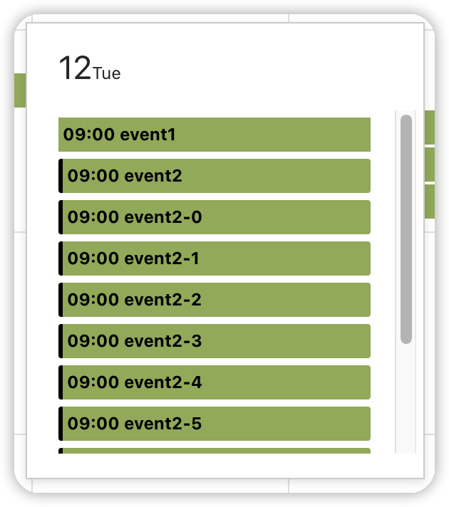 |  |

```js
calendar.setTheme({
  month: {
    moreView: {
      border: '1px solid grey',
      boxShadow: '0 2px 6px 0 grey',
      backgroundColor: 'white',
      width: 320,
      height: 200,
    },
  },
});
```

[⬆ 목록으로 돌아가기](#month-테마)

#### month-moreViewTitle

월간뷰의 더보기 팝업의 헤더 영역을 지정한다. `backgroundColor`로 배경색을 지정할 수 있으며 기본 값은 `'inherit'`이다.

| 기본값 적용                                                                 | 예제 적용                                                                  |
| --------------------------------------------------------------------------- | -------------------------------------------------------------------------- |
|  |  |

```js
calendar.setTheme({
  month: {
    moreViewTitle: {
      backgroundColor: 'grey',
    },
  },
});
```

[⬆ 목록으로 돌아가기](#month-테마)

#### month-weekend

월간뷰의 주말 셀을 지정한다. `backgroundColor`로 배경색을 지정할 수 있으며 기본 값은 `'inherit'`이다.

| 기본값 적용                                                     | 예제 적용                                                      |
| --------------------------------------------------------------- | -------------------------------------------------------------- |
| 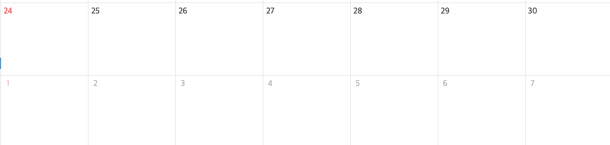 |  |

```js
calendar.setTheme({
  month: {
    weekend: {
      backgroundColor: 'rgba(255, 64, 64, 0.4)',
    },
  },
});
```

#### month-gridCell

월간뷰의 각 셀의 헤더와 푸터 높이를 지정한다. 기본적으로 푸터는 비활성화 상태이며, 푸터를 사용하기 위해서 임의의 `number` 타입의 값을 전달해야 한다.

`headerHeight` 의 기본 값은 `31`이고, `footerHeight` 의 기본 값은 `null`이다.

⚠️ 속성 값이 `null` 인 경우 헤더나 푸터가 표시되지 않는다.

| 기본값 적용                                                      | 예제 적용                                                      |
| ---------------------------------------------------------------- | -------------------------------------------------------------- |
|  | 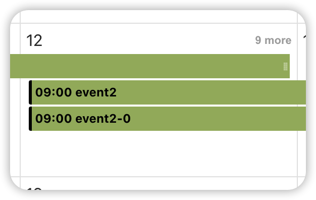 |

```js
calendar.setTheme({
  month: {
    gridCell: {
      footerHeight: 31,
    },
  },
});
```

[⬆ 목록으로 돌아가기](#month-테마)
